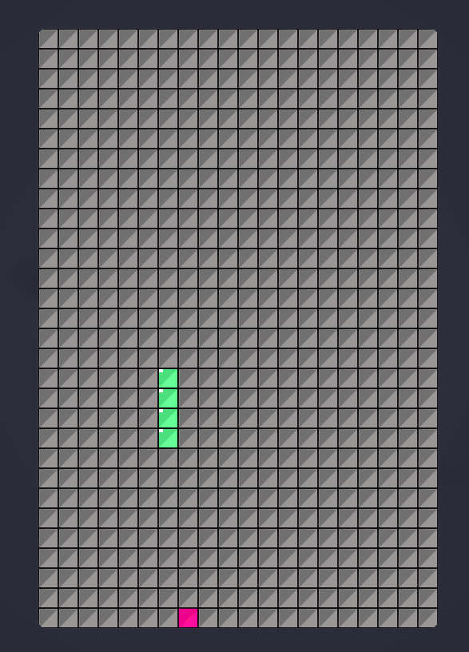

# Игра "Змейка"
<p align="center">
  
</p>
Это простая игра "Змейка", реализованная на C++ с использованием библиотеки SFML.

## Необходимые компоненты
`Компилятор C++17`
`CMake`
`SFML 2.6.1`


## Установка
### Сборка игры на Linux

1. **Установите SFML с помощью менеджера пакетов:**:
   
   For Arch Linux:
```   
   sudo pacman -S sfml
``` 
   For Debian-based systems (...Ubuntu):
```
    sudo apt install libsfml-dev
```  
   For Red Hat-based systems (...Fedora):
```
    sudo dnf install SFML-devel
```
2. **Клонируйте репозиторий:**:
```   
   git clone https://github.com/A92LEKSANDR/SnakeGame.git
   cd SnakeGame
```
3. **Создайте каталог для сборки и соберите проект:**:
```   
   mkdir build
   cd build
   cmake ..
   make
```
4. **Запуск игры**:
```   
   ./SnakeGame
```   
